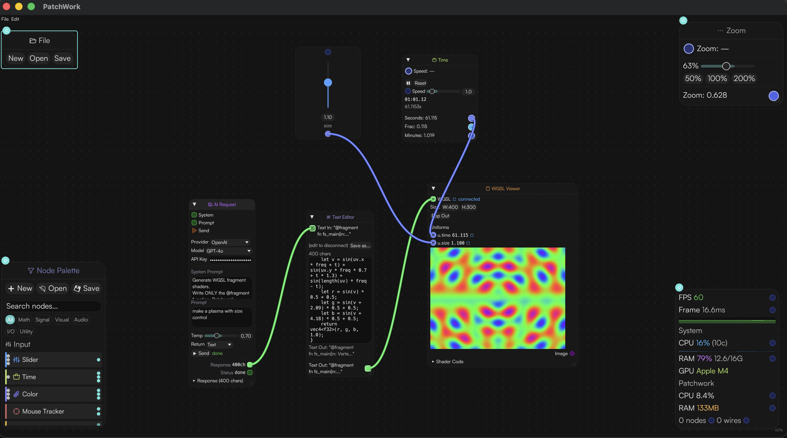

# Patchwork

A node-based visual programming environment built with Rust and [egui](https://github.com/emilk/egui).
The project started as a routing/mapping software to interface between custom hardware nodes and other creative technology environments.

Connect nodes to build data pipelines route numbers through math, load and edit files, WGSL shaders, MIDI, OSC, Serial, custom scripts, and more. Everything is a node as much as possible.




## Quick start

```bash
cargo run
```

### Build distributable (macOS)

```bash
cargo install cargo-packager
cargo packager --release 
```

Haven't yet tested on Windows - Reach out if anyone is interested!!

## How to Use?
Double-click the canvas to add nodes. Drag from output ports to input ports to connect them.


## Tech

- **[eframe](https://github.com/emilk/egui/tree/master/crates/eframe)** / **egui** / **egui_wgpu** - immediate-mode GUI with GPU rendering
- **[wgpu](https://wgpu.rs)** / **[naga](https://crates.io/crates/naga)** - GPU shader compilation and real-time rendering
- **[midir](https://crates.io/crates/midir)** - cross-platform MIDI I/O
- **[serialport](https://crates.io/crates/serialport)** - serial communication
- **[rosc](https://crates.io/crates/rosc)** - OSC protocol
- **[rhai](https://crates.io/crates/rhai)** - embedded scripting(RHAI)
- **[reqwest](https://crates.io/crates/reqwest)** - HTTP client
- **serde** / **serde_json** - serialization and JSON parsing
- **rfd** - native file workflows
- **cargo-packager** - `.app` / `.dmg` bundling for macOS 
