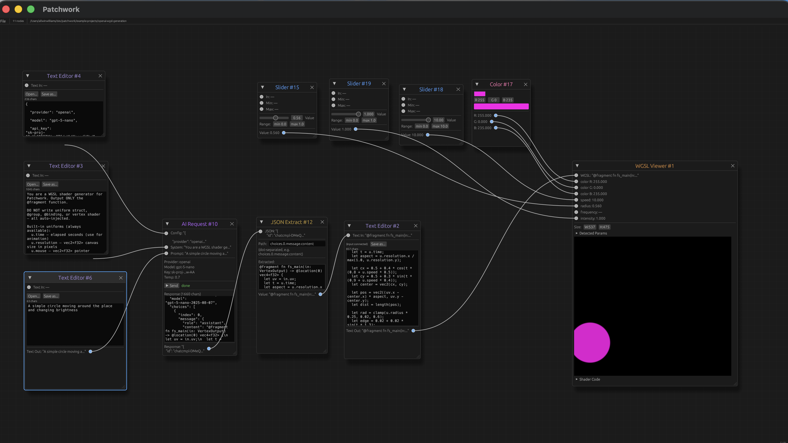

# Patchwork

A node-based visual programming environment built with Rust and [egui](https://github.com/emilk/egui).

Connect nodes to build data pipelines — route numbers through math, load and edit files, preview shaders, send MIDI/OSC, communicate over serial, run custom scripts, and more. Everything is a window. Everything connects.



## Quick start

```bash
cargo run
```

Double-click the canvas to add nodes. Drag from output ports (blue) to input ports (gray) to connect them.

### Build distributable (macOS)

```bash
cargo install cargo-packager
cargo packager --release    # produces .app and .dmg
```

## Project structure

```
src/
├── main.rs              Entry point, window setup, icon
├── app.rs               Core loop: canvas, node rendering, connections, menus, clipboard, shortcuts
├── graph.rs             Data model: Graph, Node, Connection, PortValue, evaluation engine
├── midi.rs              MIDI device manager (input/output via midir)
├── serial.rs            Serial port manager (background reader threads)
├── osc.rs               OSC manager (UDP send/receive via rosc)
└── nodes/
    ├── mod.rs           Node catalog + render dispatch
    ├── slider.rs        Float slider with configurable range and input port
    ├── display.rs       Oscilloscope display with waveform history
    ├── math.rs          Add / Multiply
    ├── file.rs          Opens any file from disk, outputs content as text
    ├── text_editor.rs   Editable text area with input/output ports
    ├── wgsl_viewer.rs   Real-time GPU shader rendering via wgpu
    ├── mouse_tracker.rs Outputs live pointer X/Y
    ├── midi_out.rs      Send MIDI Note or CC messages to a device
    ├── midi_in.rs       Receive MIDI messages with live log
    ├── serial.rs        Read/write serial ports with baud rate selection
    ├── osc_out.rs       Send OSC messages over UDP
    ├── osc_in.rs        Receive OSC messages over UDP
    ├── script.rs        Custom Rhai scripting with user-defined I/O
    ├── theme.rs         Global dark/light mode, accent color, font size
    ├── monitor.rs       Live FPS, frame time, node/connection count with sparklines
    ├── console.rs       System message log with color-coded output
    ├── comment.rs       Freeform text note
    ├── http_request.rs  Generic HTTP GET/POST with custom headers
    ├── ai_request.rs    AI API calls (Anthropic/OpenAI/custom endpoint)
    ├── json_extract.rs  JSON parsing with dot-path extraction
    ├── file_menu.rs     Project file operations (New/Open/Save)
    ├── zoom_control.rs  Canvas zoom slider with presets
    ├── key_input.rs     Keyboard key state (press/toggle)
    ├── time.rs          Elapsed time generator
    ├── color.rs         RGB color picker with component outputs
    └── palette.rs       Searchable node catalog for adding nodes
├── http.rs             HTTP manager (async background threads, reqwest)
```

## Nodes

| Node | Category | In | Out | Description |
|------|----------|:--:|:---:|-------------|
| **Slider** | Input | `In` | `Value` | Draggable float with min/max range; input overrides manual value |
| **Mouse Tracker** | Input | — | `X` `Y` | Live pointer coordinates |
| **Add** | Math | `A` `B` | `Result` | Outputs A + B |
| **Multiply** | Math | `A` `B` | `Result` | Outputs A x B |
| **File** | IO | — | `Content` | Loads any text file, outputs its content |
| **Text Editor** | IO | `Text In` | `Text Out` | Editable area; read-only when input connected |
| **Display** | Output | `Value` | — | Oscilloscope with waveform history, auto-fit, pause/resume, adjustable range and sample count |
| **WGSL Viewer** | Shader | `WGSL` + dynamic uniform ports | — | Real-time GPU shader rendering via wgpu; auto-detects `u.xxx` uniforms and creates input ports; built-in time, resolution, mouse uniforms; pop-out window support |
| **MIDI Out** | MIDI | `Channel` `Note/CC#` `Velocity/Value` | — | Send Note or CC messages; device selector, change detection |
| **MIDI In** | MIDI | — | `Channel` `Note` `Velocity` | Receive MIDI with scrolling message log |
| **Serial** | Serial | `Send` | `Received` | Read/write serial ports; baud rate selector, live log |
| **OSC Out** | OSC | `Arg 0..N` | — | Send OSC float messages over UDP; configurable host/port/address |
| **OSC In** | OSC | — | `Arg 0..N` | Receive OSC messages; address filter, listen toggle, scrolling log |
| **Script** | Custom | user-defined | user-defined | Rhai scripting engine; +/- buttons for I/O ports; continuous or manual execution |
| **HTTP Request** | Network | `URL` `Body` `Headers` | `Response` `Status` | Generic HTTP client; GET/POST, custom headers, auto-send on input change |
| **AI Request** | AI | `Config` `System` `Prompt` | `Response` `Status` | API calls to OpenAI, Anthropic, or custom endpoint; JSON config input |
| **JSON Extract** | Data | `JSON` | `Value` | Extracts values from JSON using dot-separated paths (e.g., `choices.0.message.content`) |
| **Theme** | Utility | — | — | Controls dark/light mode, accent color, font size |
| **Monitor** | Utility | — | `FPS` `Frame ms` `Nodes` | Live performance data with sparkline graphs |
| **Console** | Utility | — | — | System message log with color-coded output |
| **Comment** | Utility | — | — | Sticky note for documentation |
| **Key Input** | Input | — | `State` | Keyboard key press/toggle detection |
| **Time** | Input | — | `Elapsed` | Elapsed time with speed control and pause |
| **Color** | Input | — | `R` `G` `B` | Color picker with RGB component outputs |
| **Node Palette** | Utility | — | — | Searchable catalog for adding nodes by clicking |
| **File Menu** | System | — | — | Project operations: New, Open, Save |
| **Zoom Control** | System | `Zoom` | `Zoom` | Canvas zoom slider with presets (50%, 100%, 200%) |

### Data flow

Ports carry either **Float** or **Text** values. Connections are one-to-many from outputs, one-to-one on inputs (reconnecting replaces the previous link). The graph evaluates in 5 propagation passes per frame.

```
File ──> Text Editor ──> WGSL Viewer         (text pipeline)
Slider ──> Add ──> Multiply ──> Display      (math pipeline)
Mouse Tracker ──> Script ──> MIDI Out        (control pipeline)
Slider ──> OSC Out ──> [network] ──> OSC In  (OSC pipeline)
```

### Script node

Write custom logic in [Rhai](https://rhai.rs/). Input and output names become variables automatically:

```rhai
// Inputs: a, b    Outputs: sum, diff
sum = a + b;
diff = a - b;
```

Toggle **Continuous** mode for live evaluation, or use manual **Run** button / **Exec** input port for triggered execution.

## Interactions

| Action | What it does |
|--------|-------------|
| **Double-click** canvas | Open the Add Node menu (with search) |
| **Drag** from a port | Create a connection (output to input) |
| **Click** a node | Select it (blue highlight) |
| **Right-click** a node | Context menu: Copy, Paste, Duplicate, Delete |
| **Cmd+C / Cmd+V** | Copy / paste selected node |
| **Cmd+D** | Duplicate selected node |
| **Option+Drag** a node | Duplicate and drag the copy |
| **Delete / Backspace** | Delete selected node (when no text field focused) |
| **Close** a node (x) | Delete the node and its connections |
| **Drag & drop** a file onto the canvas | Creates a File node with that file loaded |
| **Escape** | Close menus |
| **Pinch / Cmd+scroll** | Zoom canvas in/out |
| **Middle-click drag / Space+drag** | Pan the canvas |
| **Right-click** a node → **Pin** | Fix node to screen position (unaffected by zoom/pan) |

### Default layout

New projects start with four pinned system nodes:

| Position | Node | Purpose |
|----------|------|---------|
| Top-left | File Menu | New / Open / Save project |
| Top-right | Zoom Control | Canvas zoom with slider and presets |
| Left | Node Palette | Searchable catalog to add nodes |
| Bottom-right | Monitor | Live FPS, frame time, node count |

All four are regular nodes — unpin, move, resize, or delete them as needed.

## Example projects

See **[`example-projects/`](example-projects/)** for ready-to-use workflows:

### OpenAI WGSL Generation
Generate WGSL shaders using OpenAI's API and render them in real-time.

```
System Prompt ──┐
User Prompt ───┼──> AI Request ──> JSON Extract ──> WGSL Viewer
API Config ────┘
```

**Files:**
- `example-projects/openai-wgsl-generation/project.json` — Complete node graph
- `SETUP.md` — Step-by-step configuration
- `EXAMPLE_PROMPTS.md` — 10+ shader generation prompts
- `api_keys.json.example` — API key template

**[Full OpenAI WGSL guide →](EXAMPLE_OPENAI_WGSL_WORKFLOW.md)**

**Workflow diagrams:** See **[`WORKFLOW_DIAGRAMS.md`](WORKFLOW_DIAGRAMS.md)** for visual guides to common patterns.

## AI & API Integration

The **AI Request** node supports:

- **OpenAI** — GPT-4, GPT-3.5-turbo
- **Anthropic** — Claude models
- **Custom endpoints** — Any OpenAI-compatible API

Configuration is passed as JSON:

```json
{
  "provider": "openai",
  "model": "gpt-4-turbo",
  "api_key": "sk-proj-YOUR_KEY",
  "temperature": 0.7
}
```

The **HTTP Request** node provides a generic client for any REST API.

**Project structure:** Projects are folders containing `project.json` + optional `api_keys.json` for credentials.

## Adding a new node

1. Create `src/nodes/my_node.rs` with a `pub fn render(ui, ...)` function
2. Add a variant to `NodeType` in `src/graph.rs` — implement `title()`, `inputs()`, `outputs()`, `color_hint()`
3. Add evaluation logic in `Graph::evaluate()` if the node produces output values
4. Register in `src/nodes/mod.rs`: add `pub mod my_node`, a catalog entry, and a match arm in `render_content()`

## Tech

- **[eframe](https://github.com/emilk/egui/tree/master/crates/eframe)** / **egui** / **egui_wgpu** — immediate-mode GUI with GPU rendering
- **[wgpu](https://wgpu.rs)** / **[naga](https://crates.io/crates/naga)** — GPU shader compilation and real-time rendering
- **[midir](https://crates.io/crates/midir)** — cross-platform MIDI I/O
- **[serialport](https://crates.io/crates/serialport)** — serial communication
- **[rosc](https://crates.io/crates/rosc)** — OSC protocol encoding/decoding
- **[rhai](https://crates.io/crates/rhai)** — embedded scripting engine
- **[reqwest](https://crates.io/crates/reqwest)** — HTTP client for API calls
- **serde** / **serde_json** — project serialization and JSON parsing
- **rfd** — native file dialogs
- **cargo-packager** — macOS `.app` / `.dmg` bundling

## License

This project is licensed under the **MIT License** — see [`LICENSE`](LICENSE) file for details.

You are free to use, modify, and distribute this software in personal or commercial projects.
